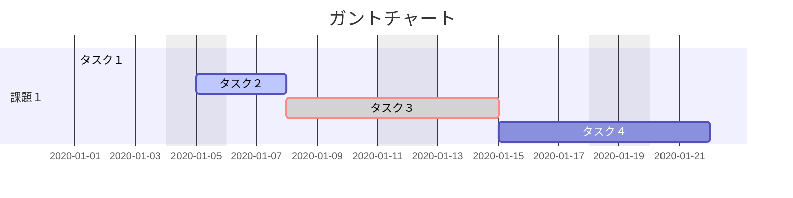

# 概要

## 導入したもの

### Material for MkDocs

[Material for MkDocs](https://squidfunk.github.io/mkdocs-material/) テーマを導入しています。

### SuperFences, Highlight

```php hl_lines="4"
<?php
class SimpleClass {
    public function display() {
        echo "Hello, World!";
    }
}
```

### Mermaid



++shift++ を押しながらドラッグでパン、++shift++ を押しながらマウスホイールでズーム可能です。
（D3.js を使用しています。）

### 日本語設定

日本語で検索可能です。

[^1]: [Material for MkDocs](https://squidfunk.github.io/mkdocs-material/reference/footnotes/) の機能

### その他

- [ ] タスク１
- [x] タスク２

注釈[^1]

絵文字 :sunglasses:

???+ note "ノート"
    内容
